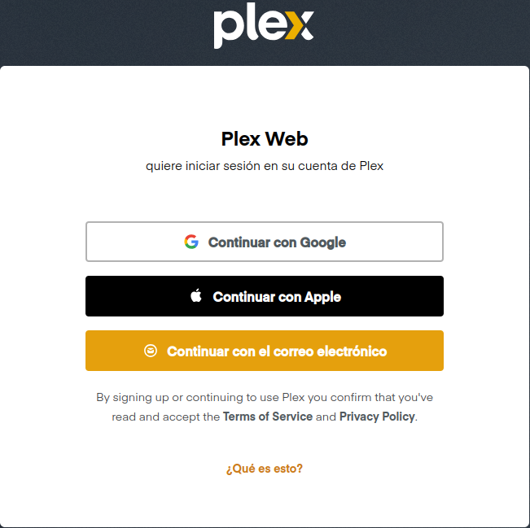

# Paso 1: 
## Crear una Cuenta Plex

# Paso 2:
## Configurar el Servidor Plex
1. Accede a Plex a través de un navegador web en tu red local navegando:
´´´
http://<IP_del_Servidor_Ubuntu>:32400/web
´´´
